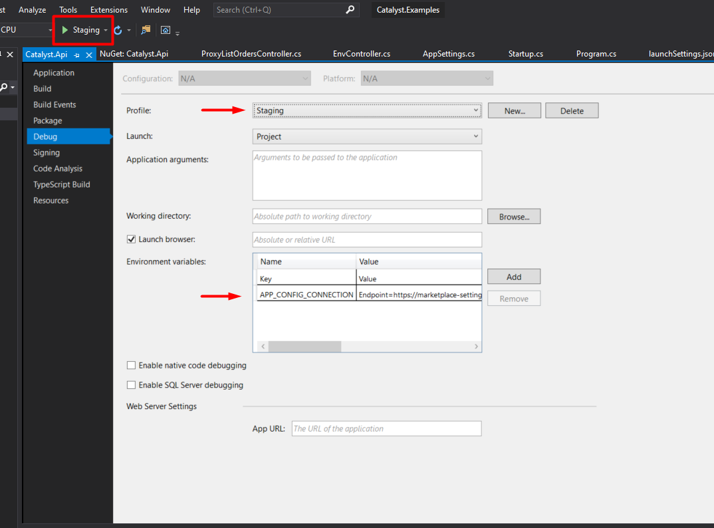
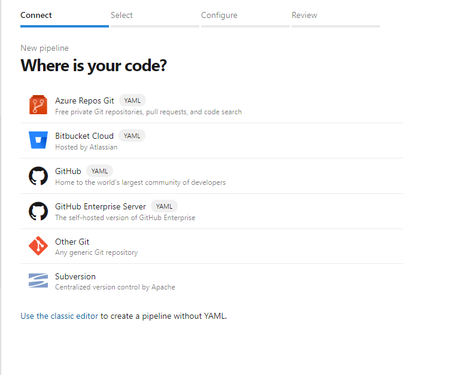

# Start an API from scratch

### What is this guide?

This guide provides step-by-step instructions to stand up a hosted middleware API using a specific technology stack. It is intended for readers with a developer background, but who may not be familiar with these specific tools. 
- [Microsoft Azure](https://docs.microsoft.com/en-us/azure/guides/developer/azure-developer-guide) for cloud hosting, 
- [.NET Core 3.1](https://docs.microsoft.com/en-us/aspnet/core/introduction-to-aspnet-core?view=aspnetcore-3.1) for development framework
- Ordercloud [Dotnet Catalyst](https://github.com/ordercloud-api/ordercloud-dotnet-catalyst) to accelerate Ordercloud-specific features. 

### Setting up Accounts

Before beginning you will need an [Ordercloud account](https://portal.ordercloud.io/register) and an [Azure account](https://azure.microsoft.com/en-us/pricing/purchase-options/pay-as-you-go). You should register for both before continuing. You will also need these free tools installed on your local machine - the .NET Framework, the .NET Core 3.1 runtime and Visual Studio 2019.

### Get Code 

Pull down the code in this dotnet-catalyst-examples repository. `git clone https://github.com/ordercloud-api/dotnet-catalyst-examples`

Get this code into your own version control system.

### Put app settings in Azure App Config

Your middleware API will need stored settings such as Ordercloud API Client credentials. We recommend storing them in Azure App Configuration. Then you can access one group of settings for hosted apps and local debugging. Follow these steps.
- Create a new Azure resource of type [App Configuration](https://docs.microsoft.com/en-us/azure/azure-app-configuration/overview).
- In the Configuration Explorer tab of the new resource, add your settings. Make sure the keys match the name of your fields in [AppSettings.cs](https://github.com/ordercloud-api/dotnet-catalyst-examples/blob/dev/Catalyst.Api/AppSettings.cs). Field nesting is represented with a colon. For example, the field `settings.OrderCloudSettings.ClientSecret` would have key `OrderCloudSettings:ClientSecret`.
- Copy the connection string from your azure resource. This is found in the Access Keys tab. 

Repeat these steps, starting with creating a new App Configuration resource in Azure, for each of your environments (e.g. Test, Stage, Prod).

### Confirm API runs locally 

Open the project in Visual Studio 2019 and add the connection string as an environment variable in a new debug profile. Do this by right clicking the WebApi project and go to Properties > Debug > New > Environment Variables. Use `APP_CONFIG_CONNECTION` as the key.

In Visual Studio 2019, select the project Catalyst.Api, and select the new debug profile ("Staging" in the image) you created with the connection string. Click the green arrow.

 https://localhost:5000 should pop up in your browser with route documentation for the starter API. Make a GET request to https://localhost:5000/api/env and you should see some of the settings you created in Azure. 

### Publish API to Azure App Service 

You will need to create a new App Service resource in azure. Then add an app setting for `APP_CONFIG_CONNECTION` in the Configuration tab the same way you did locally in Visual Studio. Once that is done, you're ready to deploy code. Deploying is its own devops discipline. For the quick and dirty purpose of getting started you can [deploy directly from Visual Studio](https://docs.microsoft.com/en-us/aspnet/core/tutorials/publish-to-azure-webapp-using-vs?view=aspnetcore-5.0). However, a CI/CD deployment tool like [Azure Devops](https://azure.microsoft.com/en-us/services/devops) can greatly improve your deploy processes. 

Azure Devops is our recommended approach. This project includes a deploy.yaml (link to come) file that specifies an Azure Devops build and release pipeline. Modify that file with your Azure App Service name and push those changes to the banch you want to deploy off. Then, in Azure Devops create new build pipeline. Specify your git repository and Azure Devops should find deploy.yaml and handle the pipeline set up.

Manually trigger a build and then a release on your new pipeline. After both have completed, you shoud have a working hosted API! Navigate to the url specified on the App Service overview tab to confirm. You should see the same behavior you saw locally. 
